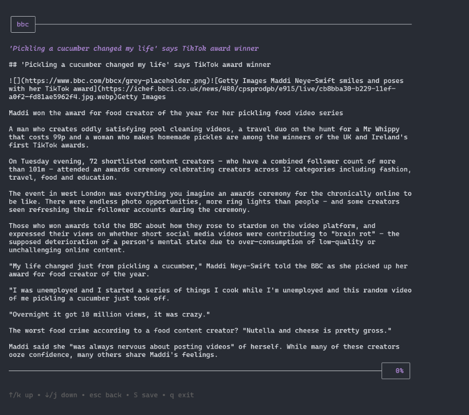

## R S S D U K E S T E R

<strong> 🚀 A simple, modern terminal-based RSS feed reader built with Go and BubbleTea </strong>

<strong> ✨ Key Features </strong>

- Feed Management: Add, remove, and organize RSS feeds with ease
- Article Preview: Read articles directly in your terminal with converted markdown text.
- Smart Search: Search across all your feeds using a keyword
- Bookmarks: Save interesting articles for later reading
- Offline Support: Access saved articles without an internet connection
- Keyboard-Driven: Efficient navigation using intuitive keyboard shortcuts
- Pre-configured Feeds: Get started immediately with curated feed suggestions

<br>
 
<details>
<summary> <strong>📷 images</strong> </summary>

   <details>
   <summary>Manage RSS feeds</summary>
   

   </details>


   <details>
   <summary>View posts from feeds</summary>

   
   </details>


   <details>
   <summary>Read articles in terminal</summary>

   
   </details>

   <details>
   <summary>Search across all your feeds</summary>

   
   </details>

</details>

<details>

<br>

<summary> <strong> 🛠️ Installation </strong> </summary>

requirements:

- Go 1.21 or later
- GCC compiler
- SQLite3
- Windows Terminal or PowerShell (CMD not supported)
<br>
<details>
<summary>windows</summary>


1. **Install MSYS2** 
   ```powershell
   winget install MSYS2.MSYS2
   ```

2. **Open MSYS2 MINGW64** (from Start Menu) and run:
   ```bash
   pacman -S mingw-w64-x86_64-gcc mingw-w64-x86_64-sqlite3
   ```

3. **Add MinGW to temporary PATH** (in PowerShell):
   ```powershell
   $env:Path += ";C:\msys64\mingw64\bin"
   ```

4. **Build**
   ```powershell
   git clone https://github.com/IvanYaremko/rssdukester.git
   cd rssdukester
   $env:CGO_ENABLED=1
   go build
   ```

5. **Run**
   ```powershell
   .\rssdukester.exe
   ```
</details>

<details>
<summary>linux</summary>

1. **Install dependencies**
   ```bash
   sudo apt-get update
   sudo apt-get install gcc libsqlite3-dev
   ```

2. **Build**
   ```bash
   git clone https://github.com/IvanYaremko/rssdukester.git
   cd rssdukester
   CGO_ENABLED=1 go build
   ```

3. **Run**
   ```bash
   ./rssdukester
   ```
</details>

<details>
<summary>macOS</summary>

1. **Install dependencies**
   ```bash
   brew install sqlite3
   ```

2. **Build**
   ```bash
   git clone https://github.com/IvanYaremko/rssdukester.git
   cd rssdukester
   CGO_ENABLED=1 go build
   ```

3. **Run**
   ```bash
   ./rssdukester
   ```
</details> 

<br>
🐛 Troubleshooting

If you see `gcc: executable file not found in %PATH%`:
1. Make sure you opened MSYS2 MINGW64 and ran the pacman command
2. Verify GCC is installed by running: `gcc --version`
3. Ensure you added MinGW to PATH as shown in the build steps
</details>

<br>

<strong>🔧 Technology Stack </strong>

`r s s d u k e s t e r`  is built with


- [Bubble Tea](https://github.com/charmbracelet/bubbletea) for the TUI
- [lipgloss](https://github.com/charmbracelet/lipgloss) for text formatting
- [go-readability](https://github.com/go-shiori/go-readability)
- [html-to-markdown](https://github.com/JohannesKaufmann/html-to-markdown) 
- [sqlite](https://www.sqlite.org/)

